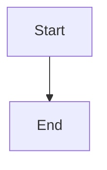

## Project Start ToDos

`bundle update`

`bundle`

`bundle exec jekyll serve` for running Jekylle Server

## Website ToDos
- [ ]Home page may be About Me
- [ ]Where and how to change home page?
- [ ]Google analytics in _config.yaml

## Blog Post Layout Guidelines

### Layout Options
- **`layout: post`** - Standard blog post layout (default)
- **`layout: mermaid-post`** - Use for posts with Mermaid diagrams

### Writing in Obsidian
When writing blog posts in Obsidian, follow these guidelines:

1. **For posts with Mermaid diagrams:**
   ```yaml
   ---
   layout: mermaid-post
   tags:
     - your_tag_here
   subtitle: Your subtitle here
   ---
   ```

2. **For standard posts:**
   ```yaml
   ---
   layout: post
   tags:
     - your_tag_here
   subtitle: Your subtitle here
   ---
   ```

### Table Syntax Fix
If you copy tables from Obsidian, you may need to fix the syntax:
- **Obsidian format:** `|| Column1 | Column2 |`
- **Jekyll format:** `| Column1 | Column2 |`

**Quick fix command:**
```bash
# Fix table syntax in a post
python3 -c "
with open('_posts/your-post.md', 'r') as f:
    lines = f.readlines()
with open('_posts/your-post.md', 'w') as f:
    for line in lines:
        if line.startswith('||'):
            f.write('|' + line[2:])
        else:
            f.write(line)
"
```

### Mermaid Diagrams
Mermaid diagrams work automatically with the `mermaid-post` layout using standard Obsidian syntax:
````markdown

````

**Note:** The `mermaid-post` layout automatically converts ````mermaid` code blocks to work with Jekyll. You can write in standard Obsidian syntax!


---
Reference:
Beautiful Jekyll Theme
- https://github.com/daattali/beautiful-jekyll

1. Add navigation links at _config.YAML


`navbar-links:
  About Me: "aboutme"
  Resources:
    - Beautiful Jekyll: "http://deanattali.com/beautiful-jekyll/"
    - Learn markdown: "http://www.markdowntutorial.com/"
   Author's home: "http://deanattali.com"`
