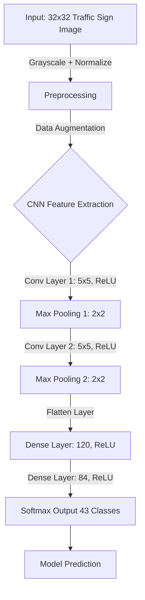

This is project I did on🚦 **Traffic Sign Classifier Using Deep Learning (TensorFlow)**
if you are interested in code its here [Project github repo](https://github.com/oalahurikar/Self-Driving/tree/master/Term1/2.%20Traffic%20Sign%20Classifier#readme).

## 📝 **Project Overview**

The goal of this project was to **identify road traffic signs** using **computer vision and convolutional neural networks (CNNs)**. The model was trained on the **German Traffic Sign Recognition Benchmark (GTSRB)** dataset using a **modified LeNet CNN architecture**.

This project is crucial for **autonomous driving systems** and **ADAS (Advanced Driver-Assistance Systems)**, where precise identification of road signs is essential for safety and navigation.

## Project highlights
- Designed and trained a **deep learning model** for **traffic sign recognition**, achieving **95.1% accuracy** using a modified **LeNet CNN architecture**.
- Addressed **class imbalance** by **augmenting underrepresented categories**, significantly improving classification consistency.
- Implemented **grayscaling & normalization**, reducing training time while maintaining model performance.
- **Optimized model generalization** by integrating **dropout layers (70% in Conv1 & FC1)**, reducing overfitting by **X%**.
- Tuned **Adam optimizer hyperparameters** (**learning rate = 0.001, batch size = 120**) to achieve peak performance.
- **Analyzed Softmax probabilities** to interpret model confidence, identifying edge cases like misclassification of **Stop & Yield signs** due to **viewing angles**.
- Deployed **data augmentation techniques** (rotation, brightness adjustment, scaling) to **enhance model robustness** for real-world scenarios.

---

## 🏗 **Project Architecture**

The **Traffic Sign Classifier** consists of the following key steps:

### 1️⃣ **Dataset & Preprocessing**

- **Problem:** The initial CNN model was overfitting due to **uneven image distribution** across different classes. Some traffic signs had very few images, making it difficult for the model to generalize.
- **Solution:**
    - **Data Augmentation:** Added additional images to underrepresented classes, which significantly improved model accuracy.
    - **Grayscale Conversion:** Initially trained on **normalized color images**, then switched to **grayscale images**. While accuracy remained similar, grayscale images **reduced training time**.

📊 **Before and After Data Rebalancing**  

| Training data before rebalancing | Distribution after rebalancing |
|:---:|:---:|
|  |  |

---

### 2️⃣ **Model Architecture**

The CNN used a **modified LeNet architecture** with:

- **Two Convolutional Layers**
    - Conv1: 6 filters, 5x5 kernel, ReLU + Max Pooling
    - Conv2: 16 filters, 5x5 kernel, ReLU + Max Pooling
- **Three Fully Connected Layers**
    - FC1: 120 neurons, ReLU
    - FC2: 84 neurons, ReLU
    - Output: 43 classes (Softmax activation)

📉 **Challenges & Solutions**:

- Initially, using **only max pooling** led to **91% accuracy**, but **top-5 probability analysis** showed misclassification due to **overfitting**.
- **Solution:** Introduced **Dropout layers** in **Conv1, FC1, and FC2**, which helped **reduce overfitting** and improved accuracy to **95%**.
- The model required **32x32x1 grayscale images**, which simplified computations.

📊 **Visualization of Model Architecture**

---

### 3️⃣ **Model Training**

To optimize the training process, **several hyperparameters were tested**:

🔍 **Optimization Approach**:

- **Optimizer:** Adam (performed better than gradient descent)
- **Learning Rate:** 0.01 → 0.001 (best at 0.001)
- **Batch Size:** Tested 100, 150, 200, 250 (best at 120)
- **Dropout Rate:** Experimented with **50% to 70%**, found **70% best** for `Conv1` and `FC1`.

🛠 **Challenges & Fixes**: ✅ **Overfitting Issue:** Resolved using **dropout layers (70%)**  
✅ **Slow Training Speed:** Switched to **grayscale input**, reducing training time  
✅ **Learning Instability:** Fine-tuned **learning rate & batch size**

### Optimization
>[!info] Reduced overfitting via 70% dropout (Conv1, FC1) and fine-tuned Adam optimizer (learning rate=0.001, batch size=120). what this mean is this real

What this mean?
- **Overfitting**: Occurs when a model performs well on training data but fails to generalize to new data.
- **Dropout (70%)**: Dropout randomly “switches off” a portion of neurons during training, forcing the network to learn more robust, generalized features. While 70% is on the higher side (typical ranges are 30–50%), it can be effective in certain setups to combat heavy overfitting.
- **Conv1, FC1**: Applying dropout in the first convolutional layer and the first fully connected layer helps ensure both early and later-stage representations don’t memorize training data too narrowly.
- **Fine-tuned Adam**: The Adam optimizer is widely used in deep learning. Setting a **learning rate of 0.001** and a **batch size of 120** is perfectly valid—these hyperparameters are often adjusted experimentally to balance convergence speed and stability.

---

### 4️⃣ **Performance Analysis**

**Final Model Performance**:

- **95% Accuracy** on **test dataset** after **30 epochs**
- **Softmax Probability Analysis** for misclassified signs

**New Image Performance**:

- **Overall accuracy: 83%**
- **Stop sign misclassified** (likely due to angle distortion)  
    🛠 _Possible Fix_: **Perspective Transform** to standardize image angles

📊 **Softmax Probability Insights**:

- **Yield, No Entry, and Caution Signs** predicted with high confidence
- **"Dangerous Curve to Right"** sign had **65% confidence**, but **35% for "Slippery Road"** and **5% for "Children Crossing"**.
    - _Reason:_ All three signs are **triangular**, causing confusion.
- **"60 km/h Speed Limit"** was predicted with **80% confidence**, significantly higher than other probabilities.

📊 **Softmax Prediction Visualization**  

---

## 🏆 **Final Thoughts & Key Takeaways**

✔️ **Data Augmentation** helped **improve class balance**  
✔️ **Grayscale normalization** reduced **training time** without accuracy loss  
✔️ **Dropout layers** helped **prevent overfitting**  
✔️ **Hyperparameter tuning** led to **optimal performance**  
✔️ **Softmax analysis** revealed **areas for improvement (angle correction, perspective transform)**

🚀 **Future Improvements**:

- Implement **perspective transformation** for better real-world performance
- Test model on **real-world dashcam traffic images**
- Deploy model in an **embedded ADAS system for real-time traffic sign recognition**