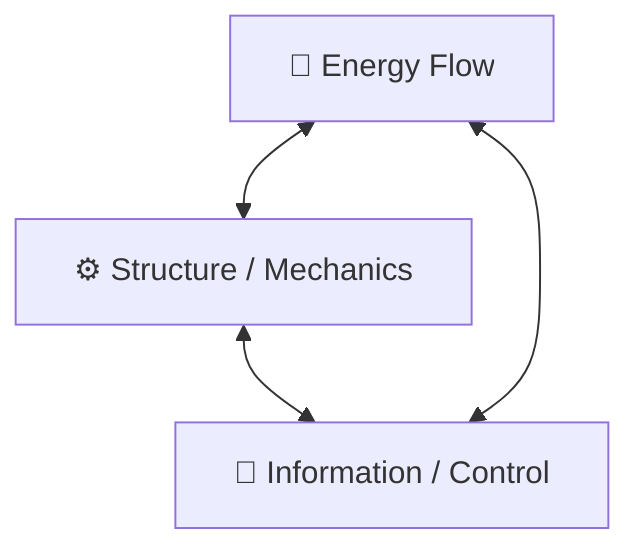

## First Principles Foundation
Every mechatronic system, no matter how advanced, depends on **three natural laws** and **three human-designed layers**.

| **Category** | **First Principle**               | **What It Means**                                                                   | **Example (Drone)**                                 |
| ------------ | --------------------------------- | ----------------------------------------------------------------------------------- | --------------------------------------------------- |
| **Physics**  | **Energy Conservation**           | Energy only transforms — never disappears.                                          | Battery → Electrical → Mechanical → Lift            |
| **Physics**  | **Force Balance (Newton’s Laws)** | Motion only changes if net forces or torques act.                                   | Thrust = Weight + Drag for hover                    |
| **Physics**  | **Information Causality**         | The system can only react to what it senses and processes.                          | IMU detects acceleration → controller responds      |
| **Design**   | **Functional Hierarchy**          | System decomposes into functions that exchange matter, energy, and information.     | Sensor → Estimator → Controller → Actuator          |
| **Design**   | **Feedback & Control**            | All stable systems self-regulate through negative feedback loops.                   | PID loop maintains roll angle                       |
| **Design**   | **Constraint Satisfaction**       | Every system operates within limited energy, material, and computational resources. | Battery limits flight time; CPU limits control rate |
### **Three Core Dependencies (at the heart of every mechatronic system)**
1. **Energy Dependency**
> Without energy, nothing moves.
- Determines what’s _possible_ physically.
- Propagates from `source → conversion → actuation → losses`.
Example:
`Energy Source → Power Electronics → Actuator → Motion → Heat`

2. **Information Dependency**
> Without information, nothing knows what to do.
- Determines what’s _controlled_ or _regulated_.
- Propagates from **sensor → processing → decision → command**.
Example
`Sensors → Estimation → Control Logic → Actuators`

3. **Material/Structural Dependency**
> Without structure, nothing can support or resist forces.
- Determines how the system _interacts_ with environment and supports itself.
- Propagates from `Load → stiffness → deformation → dynamics`.
Example
`Payload → Frame → Dynamics → Vibrations → Sensor noise`
### Interdependency Loop (Energy ↔ Information ↔ Structure)
- **Energy → Structure:** Power causes motion or deformation.
- **Structure → Information:** Motion generates sensor data.
- **Information → Energy:** Control logic modulates power flow.
This triad is the _core_ of any system — change one, the others must adapt.

## **First Principles Dependency Hierarchy**

| **Layer**       | **Dependency**            | **Question to Ask (System Thinking)**          |
| --------------- | ------------------------- | ---------------------------------------------- |
| **Physical**    | Energy ↔ Structure        | How do forces and energy flow?                 |
| **Control**     | Information ↔ Energy      | How is power modulated and optimized?          |
| **Software**    | Information ↔ Information | How is data transformed into decisions?        |
| **Integration** | Structure ↔ Information   | How does mechanics affect sensing and control? |
| **Environment** | System ↔ External         | How does the system adapt to external change?  |

|**Dependency Type**|**Emerges From**|**Explanation**|
|---|---|---|
|**Mass–Energy Coupling**|Energy + Structure|Heavier payload → more energy required for same motion|
|**Power–Control Coupling**|Energy + Information|Control loops limited by available actuator power|
|**Mechanical–Sensor Coupling**|Structure + Information|Frame vibration → sensor noise → estimator error|
|**Thermal–Performance Coupling**|Energy + Structure|High current → heat → material degradation|
|**Software–Hardware Coupling**|Information + Energy|Control laws depend on actuator dynamics and bandwidth|
|**Environment–System Coupling**|All three|External disturbances (wind, temp) affect energy and structure, sensed via information|
