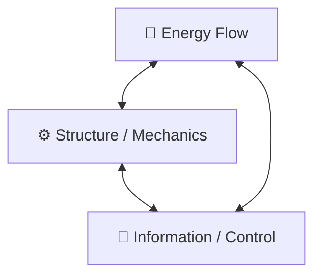

## First Principles Foundation
**Every mechatronic system is an energy–information–structure loop under constraints.**
- _Energy_ enables motion.
- _Structure_ shapes and constrains motion.
- _Information_ regulates motion through feedback.
> **System intelligence lies in managing these dependencies predictably and stably.**
   
Every mechatronic system, no matter how advanced, depends on **three natural laws** and **three human-designed layers**.

| **Category** |        **First Principle**        |                                  **What It Means**                                  |                 **Example (Drone)**                 |
| :----------: | :-------------------------------: | :---------------------------------------------------------------------------------: | :-------------------------------------------------: |
| **Physics**  |      **Energy Conservation**      |                      Energy only transforms—never disappears.                       |      Battery → Electrical → Mechanical → Lift       |
| **Physics**  | **Force Balance (Newton’s Laws)** |                  Motion only changes if net forces or torques act.                  |          Thrust = Weight + Drag for hover           |
| **Physics**  |     **Information Causality**     |             The system can only react to what it senses and processes.              |   IMU detects acceleration → controller responds    |
|  **Design**  |     **Functional Hierarchy**      |   System decomposes into functions that exchange matter, energy, and information.   |     Sensor → Estimator → Controller → Actuator      |
|  **Design**  |      **Feedback & Control**       |          All stable systems self-regulate through negative feedback loops.          |            PID loop maintains roll angle            |
|  **Design**  |    **Constraint Satisfaction**    | Every system operates within limited energy, material, and computational resources. | Battery limits flight time; CPU limits control rate |

|     |     |
| --- | --- |
|     |     |
### **Three Core Dependencies (at the heart of every mechatronic system)**
1. **Energy Dependency**
> Without energy, nothing moves.
- Determines what’s _possible_ physically.
- Propagates from `source → conversion → actuation → losses`.
Example:
`Energy Source → Power Electronics → Actuator → Motion → Heat`

2. **Information Dependency**
> Without information, nothing knows what to do.
- Determines what’s _controlled_ or _regulated_.
- Propagates from **sensor → processing → decision → command**.
Example
`Sensors → Estimation → Control Logic → Actuators`

3. **Material/Structural Dependency**
> Without structure, nothing can support or resist forces.
- Determines how the system _interacts_ with environment and supports itself.
- Propagates from `Load → stiffness → deformation → dynamics`.
Example
`Payload → Frame → Dynamics → Vibrations → Sensor noise`
### Interdependency Loop (Energy ↔ Information ↔ Structure)
- **Energy → Structure:** Power causes motion or deformation.
- **Structure → Information:** Motion generates sensor data.
- **Information → Energy:** Control logic modulates power flow.
This triad is the _core_ of any system — change one, the others must adapt.

## **First Principles Dependency Hierarchy**

| **Layer**       | **Dependency**            | **Question to Ask (System Thinking)**          |
| --------------- | ------------------------- | ---------------------------------------------- |
| **Physical**    | Energy ↔ Structure        | How do forces and energy flow?                 |
| **Control**     | Information ↔ Energy      | How is power modulated and optimized?          |
| **Software**    | Information ↔ Information | How is data transformed into decisions?        |
| **Integration** | Structure ↔ Information   | How does mechanics affect sensing and control? |
| **Environment** | System ↔ External         | How does the system adapt to external change?  |

|**Dependency Type**|**Emerges From**|**Explanation**|
|---|---|---|
|**Mass–Energy Coupling**|Energy + Structure|Heavier payload → more energy required for same motion|
|**Power–Control Coupling**|Energy + Information|Control loops limited by available actuator power|
|**Mechanical–Sensor Coupling**|Structure + Information|Frame vibration → sensor noise → estimator error|
|**Thermal–Performance Coupling**|Energy + Structure|High current → heat → material degradation|
|**Software–Hardware Coupling**|Information + Energy|Control laws depend on actuator dynamics and bandwidth|
|**Environment–System Coupling**|All three|External disturbances (wind, temp) affect energy and structure, sensed via information|

---
# QA
## What “Power–Control Coupling” Means?
> The **controller’s ability to command motion** is limited by the **available actuator power and energy flow capacity.**

Control algorithm can _demand_ fast corrections or sharp maneuvers, but the **actuators (motors + battery)** decide _how much of that can actually happen_ — in both magnitude and timing.

- **Control → Power:** The controller commands power output (motor speed, torque).
- **Power → Control:** The available power limits how aggressive or fast the control can respond.

## **Real-World Example: Sudden Payload Increase**
Imagine your drone picks up a **heavier payload** than expected.

|**Parameter**|**Before**|**After**|**Consequence**|
|---|---|---|---|
|Mass|2.0 kg|2.5 kg|Thrust demand ↑ 25%|
|Hover Power|200 W|250 W|Power draw ↑|
|Available Power|300 W|300 W|Margin ↓ 50 W|
|Control Authority|High|Reduced|Risk of saturation|
Now:
- Controller still asks for same pitch/roll correction rate.
- Motors saturate near 100% duty cycle — can’t produce more torque.
- **Result:** Control lag → overshoot → oscillation → instability.
- The root cause: **Power limit violated → Control loop loses authority.**

>[!info] Thus, _stability_ is not only a matter of control theory — it’s a **physics–energy–information problem**.

## **Mathematical Insight**
Let’s represent the coupling mathematically.
1. **Actuator Power Constraint**
$$
P_{available} = V \cdot I_{max}
$$
where V is battery voltage, $I_{max}$ is ESC/motor current limit.

2. **Controller Command**
    $$
    \tau_{cmd} = K_p(e) + K_d(\dot{e})
    $$
    
    The control law demands a torque (or thrust) proportional to the error.

2. **Actuator Output (Clipped by Power)**
$$  
    \tau_{actual} = \min(\tau_{cmd}, \tau_{max}) 
    $$
    where
    $$
    \tau_{max} = \frac{P_{available}}{\omega}
    $$
3. **Coupling Condition**
    When $\tau_{cmd} > \tau_{max}$,
    → control output saturates,
    → loop becomes **nonlinear**,
    → possible **instability or limit cycles**.

## **Manifestations in Real Drones**

| **Scenario**                       | **Effect of Power–Control Coupling**                           |
| ---------------------------------- | -------------------------------------------------------------- |
| **Low Battery Voltage**            | Same command → less thrust → sluggish control → altitude loss  |
| **Aggressive PID gains**           | Demands torque faster than motor can deliver → oscillations    |
| **Cold Battery / Low Temperature** | Internal resistance ↑ → current limit ↓ → response delay       |
| **High Payload or Wind Gust**      | Energy demand ↑ → power headroom ↓ → reduced control authority |
| **ESC current limit hit**          | PWM saturates → feedback loop starved of actuation             |

## **How Engineers Manage This Coupling**
| **Design Strategy**                | **Purpose**                                    | **System Thinking View**             |
| ---------------------------------- | ---------------------------------------------- | ------------------------------------ |
| **Add Power Margin**               | Oversize battery/motor to ensure authority     | Expand energy envelope               |
| **Adaptive Control Gains**         | Adjust PID gains as voltage or payload changes | Close the info-energy loop           |
| **Power-Aware Flight Controller**  | Integrate battery model into control           | Predict saturation before it happens |
| **Digital Twin Simulation**        | Co-simulate powertrain + control               | Validate dynamic coupling early      |
| **Thermal and Current Monitoring** | Detect overloads early                         | Keep feedback within safe limits     |

## **Summary**
> **Power–Control Coupling** = _the handshake between energy physics and decision logic._

A stable mechatronic system is one where:
- The **controller never commands beyond what physics can deliver**,
- And the **power system never lags faster than control expects**.