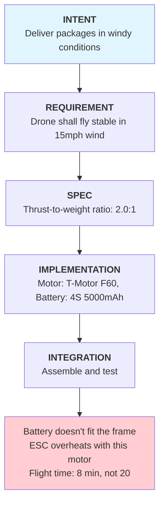

In 2018 and 2019, two Boeing 737 MAX aircraft crashed, killing 346 people. The investigations revealed a software system called MCAS that pilots didn't know existed, relying on a single sensor, with authority that had been quietly expanded late in development. Boeing had some of the most rigorous systems engineering processes in the world. They had requirements. They had specifications. They had testing. And still, the system that shipped wasn't the system they intended to build.

How does a company with decades of aerospace experience, formal safety processes, and thousands of engineers ship a system where intent and reality diverge so catastrophically?

## The Pattern: This Isn't Isolated

The 737 MAX isn't an anomaly. It's part of a pattern that spans industries, company sizes, and decades.

| Failure | What They Wanted | What They Got | What Went Wrong |
|---------|------------------|---------------|-----------------|
| Boeing 737 MAX | Plane that pilots already know how to fly | Plane with hidden software that fought pilots | Nobody connected "no retraining" to "pilots need to know about new systems" |
| Mars Climate Orbiter | Spacecraft that reaches Mars | Spacecraft that burned up on arrival | One team used pounds, another used newtons — nobody checked |
| Therac-25 | Radiation machine that can't overdose patients | Machine that gave 100x lethal doses | Old hardware safety removed, software never tested without it |
| Jawbone UP | Fitness tracker that works | Product recalled within a month | Worked in the lab, failed in customers' hands |

These failures share a common root cause: the systematic degradation of intent as it travels from conception to integration. The gap between what a system was meant to do and what it actually does isn't a bug — it's a structural feature of how we build complex systems.

## The Three Paradigms: Where We Place Truth

Before diagnosing why the gap exists, we need to understand how engineering organizations think about system definition. There are three paradigms, each placing the "source of truth" in a different location:

| Paradigm | The Question | The Artifact | Where Truth Lives |
|----------|--------------|--------------|-------------------|
| **Requirement-Driven** | "What must it do?" | Shall statements | The Document |
| **Spec-Driven** | "What are the parameters?" | Datasheets, APIs | The Blueprint |
| **Intent-Driven** | "What outcome does the user need?" | Goals, Jobs-to-be-Done | The Purpose |

Each paradigm has its own failure mode:

- **Requirements** can be ambiguous. "The aircraft shall have handling characteristics similar to 737NG" — similar in what conditions? Under what load? In what failure states?
- **Specs** can be precise but wrong. MCAS met its specifications perfectly. The specification itself was flawed.
- **Intent** can be vague without rigorous translation. "Pilots should fly this without retraining" is a business goal, not an engineering constraint.

Applied to Boeing, all three existed:
- **Intent**: Pilots should be able to fly this plane without new type certification
- **Requirement**: The aircraft shall have handling characteristics similar to 737NG
- **Spec**: MCAS shall adjust stabilizer trim up to 2.5 degrees per activation using single AOA input

Boeing's tragedy wasn't a failure of any single paradigm. It was a failure to maintain traceability between them. The business intent drove requirements, which drove specs, but by integration time, nobody could trace back to ask: "Does this configuration still serve the original purpose?"

## The Diagnosis: Three Structural Forces

### Force 1: Conway's Law — You Ship Your Org Chart

> "Organizations which design systems are constrained to produce designs which are copies of the communication structures of those organizations." — Melvin Conway, 1967

Every organizational boundary becomes an integration boundary. If your mechanical team doesn't talk to your software team, their components won't talk either — not really.

Boeing's organizational structure became Boeing's system architecture:
- Cost optimization team (business)
- MCAS development team (software)
- Safety analysis team (certification)
- Pilot training team (operations)

Each team optimized locally. MCAS was expanded for aerodynamic reasons. Safety analysis used assumptions about pilot response time. The training team was told the plane was "the same." Nobody owned the integration of these decisions across organizational boundaries.

For startups, the same force operates in compressed form. Founders hold intent, engineers hold specs, and "integration" is what happens at 2am before the demo.

### Force 2: The 78x Curve — Errors Are Made Early, Found Late

NASA research on error cost escalation reveals a brutal truth about when problems are created versus when they're discovered:

| Phase Where Error is Found | Cost to Fix |
|---------------------------|-------------|
| Requirements | 1x |
| Design | 3-8x |
| Build | 7-16x |
| Integration & Test | 21-78x |
| Operations | 29-1500x |

The structural trap: intent errors are created during requirements, but they're invisible through design and build because each component "works" in isolation. They only surface during integration, when components don't work together. By then, fixing them means rework across multiple teams and budgets.

The decision to use a single AOA sensor for MCAS was made early. It "worked" in component testing. It failed catastrophically in operations — but the error was baked in at requirements.

The Mars Climate Orbiter unit mismatch was a requirements-phase error. It was discovered at operations. Cost: complete mission loss.

### Force 3: The Ownership Vacuum — Everyone's Child, No One's Responsibility

The paradox of integration:
- Integration engineers have the clearest view of system-level problems
- They have the least authority to fix them
- They inherit decisions; they don't make them
- When they raise issues, they're told "make it work," not "let's revisit the design"

In large companies, integration is a *phase*, not a *discipline*. It's where problems surface, but ownership traces back to teams that have moved on to other projects.

In startups, integration isn't even a phase — it's "the last week before launch" where everything is supposed to magically come together.

The result: the gap between intent and integration has no owner. It exists in organizational negative space.

## The Mechanism: How Intent Degrades

Information flows down through an organization, but rarely flows back up. Each handoff loses context. Consider a simple example — a startup building a delivery drone:

What got lost at each handoff:

| Handoff | What Was Lost |
|---------|---------------|
| Intent → Requirement | Why 15mph? What about gusts? What's the safety margin? |
| Requirement → Spec | The relationship between thrust ratio and the original wind requirement |
| Spec → Implementation | Why these specific components? What constraints matter? |
| Implementation → Integration | How components interact under load, heat, vibration |

The arrows only point downward. Integration teams inherit decisions but can't easily push back to question intent. By the time they discover the battery doesn't fit, the frame was finalized weeks ago by a different team.

## Startup vs. Enterprise: Same Disease, Different Symptoms

| Dimension | Startup | Enterprise |
|-----------|---------|------------|
| **Where intent lives** | Founder's intuition | Requirements documents |
| **How intent travels** | Conversations, Slack, tribal knowledge | Formal handoffs, reviews, documents |
| **Translation layer** | Nonexistent (move fast) | Exists but fossilizes (spec becomes truth) |
| **Integration approach** | "We'll figure it out" | Formal I&T phase (but too late) |
| **Who owns the gap** | Nobody — everyone's building | Nobody — not in job descriptions |
| **Discovery moment** | First customer deployment | Certification testing or field failure |

The common thread: the gap isn't created by negligence. It's created by structure. Speed (startups) and bureaucracy (enterprise) both produce the same blindness — just through different mechanisms.

**Startups** fail because intent never gets formalized. The founder knows what they want. The engineers think they know what the founder wants. The product that ships reflects the delta between those two mental models.

**Enterprises** fail because intent gets formalized and then fossilized. Requirements documents become sacred texts. By the time reality contradicts the requirements, changing them requires more organizational energy than "making it work" at integration.

Both paths lead to the same destination: systems where the whole doesn't match the sum of the parts.

## The Uncomfortable Truth

The 737 MAX wasn't built by an inexperienced team. Mars Climate Orbiter wasn't lost by junior engineers. These systems were built by experienced professionals in organizations with established processes. They failed anyway.

The failures weren't random. They followed a pattern:
- Intent that was clear at the beginning became unrecognizable by integration
- Requirements that made sense in isolation produced systems that failed as wholes
- Components that passed every test combined into products that didn't work

This isn't a problem you solve with better tools or more process alone. It's a structural problem — a consequence of how organizations divide work, transfer knowledge, and allocate ownership.

Some organizations are experimenting with approaches that attack this structure directly: Model-Based Systems Engineering that maintains relationships instead of documents, Contract-Based Design that provides mathematical guarantees at interfaces, Test-Driven Systems Engineering that writes verification before requirements. But tools alone won't close the gap. The gap is organizational, not just technical.

The question isn't whether your system has this gap. Every complex system does.

The question is: **Can you see it before integration? And if you see it, do you have the authority to act?**
